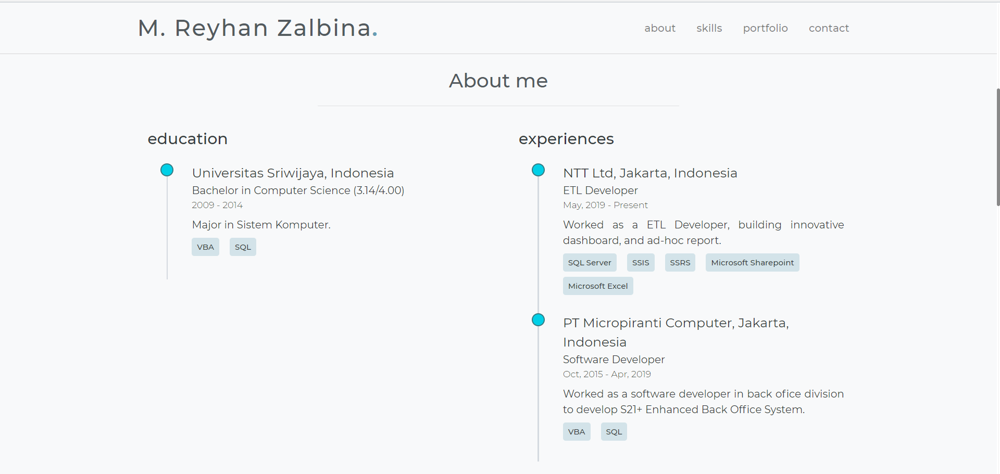

# Portfolio Template 🖐

> This is a simple, minimal and responsive personal website template, built using vue-js, html and css.

[](https://github.io/)
[](https://github.com/npm/cli)
[](https://github.com/reyhanzal/Portfolio-Web-Vue/blob/master/LICENSE)
[](https://github.com/vuejs/vue)



<!--


💻 Live [demo](https:github.io)
-->

---

## Table of Contents

- [Installation](#installation)
- [Features](#features)
- [Usage](#usage)
- [Contributing](#contributing)
- [Connect](#connect)
- [License](#license)

---

## Installation

### Dependencies

These are the local dependencies that are needed for development,

- npm
- git

### Clone

Get this repo to your local machine using,

```shell
$ git clone https://github.com/reyhanzal/Portfolio-Web-Vue.git
```

### Setup

To install the node packages used in the project:

```shell
$ cd Portfolio-Web-Vue
$ npm install
```

Compiles and hot-reloads for development

```shell
$ npm run serve
```

Compiles and minifies for production

```shell
$ npm run build
```

---

## Usage

This section goes over the tweaks that need to be made, and where can they be made. It also talks about the free emailing service that is been used.

### Information

All the information on the template is present in `info.js` that can be found in the root director, or [here](https://github.com/hrishikeshpaul/portfolio-template/blob/master/info.js). This consists of various parameters that handle the information on the website. To add your own information, just edit the contents of this file, and the changes should be noticed. All the pictures need ot be present in `/src/assets` (or you can configure the path in the info.js file).

### Email.js

The **contact** section of the template makes use of this API called [emailjs](https://www.emailjs.com/). It is a good service that provides 200 email free every month. You will need to configure your own emailjs account for the service to work.

#### Configuration

1. Head over to [emailjs](https://www.emailjs.com/) and create your account.
2. Once logged in, select a service. In my case I selected **gmail**.
3. Head over to **Email Templates** on the side and click on **Email Template Example**. Here, there are few changes to be made if you don't want to change the template's javascript code.

   - Change the subject attribute to: `New message from {{from_name}}!`
   - Change the body to,

   ```js
   Hello {{to_name}},

   You got a new message from {{from_name}}:

   {{{message_html}}}

   My contact is: {{user_email}}.
   ```

   You can configure this however you want, but the attributes in the `{{ }}` need to be those.

4. Create a file called `config.js` in the root of the project. You'll notice that the `.gitignore` has the name of this file. This is where all the data that links your web app to emailjs will be stores.
5. Create a object that looks like this,

   ```js
   let config = {
     emailjs: {
       serviceID: "<serviceID>",
       templateID: "<templateID>",
       userID: "<userID>",
     },
   };

   export default config;
   ```

6. You need to get the above mentioned IDs from your emailjs account,
   - **serviceID**: From `Email Services`
   - **templateID**: From `Email Templates`
   - **userID**: From `Account` > `API Keys`

> Make sure your `config.js` is in `.gitignore` as you do not want to expose your keys to the public.

---

## License

[](https://github.com/hrishikeshpaul/portfolio-template/blob/master/LICENSE)

- **[MIT license](http://opensource.org/licenses/mit-license.php)**
- Copyright 2020 © <a href="https://hrishikeshpaul.github.io/" target="_blank">Hrishikesh Paul</a>
